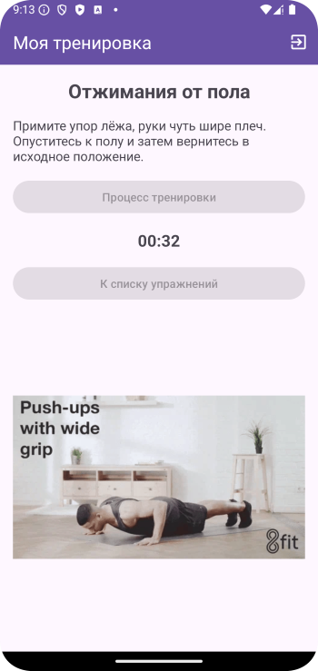
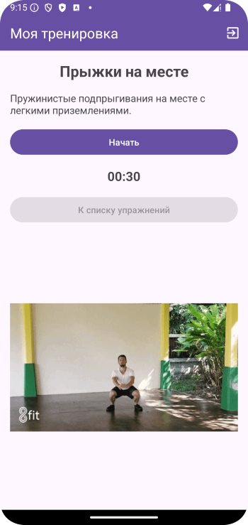

# Домашнее задание по теме "MyTrainingSession"

### Приложение «Тренировки по фитнесу».

Необходимо добавить упражнения в созданное нами приложение с таким расчетом, чтобы их в приложении было не менее десяти. Если получится сделать на разные качества (сила, ловкость, быстрота, выносливость) было бы хорошо. Приложение должно запускаться со стартового экрана, на котором находится название упражнения, картинка, символизирующая направленность приложения, слоган или девиз и кнопка **«Переход к тренировке»**, по нажатию на которую выполняется переход на следующий экран – основной экран тренировок. Это тот экран, на котором работали в процессе занятия. На этом экране логика работы аналогична той, что описана на занятии. Кроме того, в приложении на обоих экранах существует Toolbar с заголовком **«Тренировки по фитнесу»** и меню с пунктом выхода из приложения **«Exit»**.

Для работы приложения необходимо создать:

На первом экране:

1. Поле ввода названия упражнения.

2. Поле размещения стартовой картинки.

3. Поле вывода слогана или девиза.

4. Кнопка **«Переход к тренировке»**.

На втором экране:

1. Поля вывода, кнопки и **imageView** для **gif** согласно верстке экрана основного занятия.

5. Меню с пунктом **«Exit»**.

**\*\*\* Необязательно, но желательно (усложненный уровень).**

После перехода со стартового экрана, мы попадаем на экран со списком имеющихся упражнений. По нажатию на элемент списка переходим на экран выполнения упражнения, он выше описан, как второй экран, там происходит тренировка по выбранному упражнению. И на каждом экране есть возможность выхода из приложения.

Приложение необходимо сохранить проектом в удаленном репозитории, для проверки качества предоставить ссылку преподавателю, либо сделать видео экрана реального устройства в процессе работы приложения.

### Скриншоты домашнего задания по теме "MyTrainingSession"

 Скриншоты здесь 

